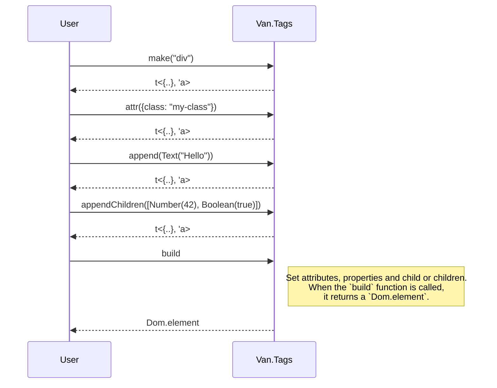

# API Index Reference

VanJS provides a comprehensive API for building reactive applications. Below is an index of those APIs for more details check the [VanJS documentation](https://vanjs.org/tutorial).

## DOM Composition and Manipulation

### `Van.add`

**Description:**
Mutates DOM by appending 0 or more child nodes to it Returns a DOM element for possibly further chaining.

**Signature:**
```reason
let add: (Dom.Element, array<Child.t<'a>>) => Dom.Element
```

Parameters:
- `parent: Dom.element`: The parent element to which children will be added.
- `children: array<Child.t<'a>>`: An array of child nodes to be added. Each child can be a text node, number, integer, boolean, DOM element, reactive state, or a null value.
- Returns: `Dom.element`: The parent element after children have been added, allowing for further chaining.

#### `Child.t<'a>` (Variant)

`Child.t<'a>` is a variant type representing all node types that can be added as children in VanJS. This allows you to pass a wide range of values as children, making the API flexible and ergonomic.

**Signature:**
```reason
type t<'a> =
  | Text(string)
  | Number(float)
  | Int(int)
  | Dom(Dom.element)
  | Boolean(bool)
  | State(state<'a>)
  | Nil(Null.t<'a>)
```

**Variant cases:**
- `Text(string)` — A text node.
- `Number(float)` — A floating-point number node.
- `Int(int)` — An integer node.
- `Dom(Dom.element)` — A raw DOM element.
- `Boolean(bool)` — A boolean value (typically rendered as text).
- `State(state<'a>)` — A reactive state value; the DOM will update when the state changes.
- `Nil(Null.t<'a>)` — Represents a null or empty value (no node will be rendered).

This design allows you to pass strings, numbers, booleans, DOM elements, and reactive state directly as children, and VanJS will handle them appropriately.

**Example:**

Let's say there is the the following `HTML` structure:

```html
<html>
  <body>
    <div id="app">
      <h1>Hello, World!</h1>
      <p>This is a simple VanJS example.</p>
    </div>
  </body>
</html>
```

You can use `Van.add` to create this structure programmatically:

```reason
// External bindings for the DOM API
@val @scope("document") @return(nullable)
external getElementById: string => optiona<Dom.element> = "getElementById"
@val @scope("document)
external createElement: string => Dom.element = "createElement"

let appElement = getElementById("app")
switch appElement {
| Some(parent) =>
    Van.add(parent, [
      Text("A new Hello, World!"),
      Dom(createElement("p"))
    ])->ignore
| None => Console.error("Element with id 'app' not found.")
}
```

The result in the `HTML` will be:

```html
<html>
  <body>
    <div id="app">
      <h1>Hello, World!</h1>
      <p>This is a simple VanJS example.</p>
      A new Hello, World!
      <p></p>
    </div>
  </body>
</html>
```

?> Futher information of the `Van.add` can be found in the [VanJS documentation](https://vanjs.org/tutorial#api-add).

### `Van.Tags` Module

The `Van.Tags` module provides a **builder-pattern API** for constructing DOM elements in memory before attaching them to the document. This approach enables you to fluently compose elements, set attributes, and append children, all in a type-safe and ergonomic way.

#### `type namespace` (Variant)

`type namespace` is a variant type that represents the different namespaces used in the DOM. Namespaces are important for correctly rendering elements, especially when dealing with SVG or MathML.

**Signature:**
```reason
type namespace =
  | Html
  | Svg
  | MathMl
  | Custom(string)
```

**Variant cases:**
- `Html` — The default namespace for standard HTML elements.
- `Svg` — For SVG elements (`"http://www.w3.org/2000/svg"`).
- `MathMl` — For MathML elements (`"http://www.w3.org/1998/Math/MathML"`).
- `Custom(string)` — For any custom namespace URI, allowing you to specify a namespace for elements that are not part of the standard HTML, SVG, or MathML.

#### `type t<'p, 'a>` (Builder)

`type t<'p, 'a>` is a type that represents a DOM element builder in VanJS. It encapsulates the tag name, namespace, optional attributes, and optional children, allowing you to construct elements in a fluent and type-safe manner.

**Signature:**
```reason
type t<'p, 'a> = {
  tag: string,
  namespace: namespace,
  attrs?: 'p,
  children?: array<Child.t<'a>>
}
```

Parameters:
- `'p` — The type of the attributes/properties object.
- `'a` — The type of the children elements.
- `tag: string` — The tag name of the element (e.g., `"div"`, `"span"`).
- `namespace: namespace` — The namespace of the element, which can be HTML, SVG, MathML, or a custom namespace.
- `attrs?: 'p` — An optional object containing attributes or properties for the element.
- `children?: array<Child.t<'a>>` — An optional array of child nodes that can be text, numbers, DOM elements, reactive states, or null values.

#### `Van.Tags.make`

**Description:**
Creates a new element builder with the specified tag name and namespace. This function is the entry point for constructing elements in VanJS.

**Signature:**
```reason
let make: (string, ~namespace: namespace=?) => t<{..}, 'a>
```

Parameters:
- `tag: string` — The HTML/SVG/MathML tag name (e.g., "div", "svg").
- `~namespace: namespace=?` — The namespace for the element, which can be `Html`, `Svg`, `MathMl`, or a custom namespace. Defaults to `Html`.
- Returns: `t<{..}, 'a>` — A new element builder with the specified tag and namespace, ready to have attributes and children added.

#### `Van.Tags.attr`

**Description:**
Adds an attribute to the element builder. This function allows you to set properties or attributes on the element being constructed.

**Signature:**
```reason
let attr: (t<'oldProps, 'a>, 'newProps) => t<'newProps, 'a>
```

Parameters:
- `t<'oldProps, 'a>` — The current element builder with its existing properties and children.
- `'newProps` — The new properties or attributes to add to the element. This must be an object containing key-value pairs representing the attributes.
- Returns: `t<'newProps, 'a>` — A new element builder with the updated properties and the same children.

#### `Van.Tags.append`

**Description:**
Appends a single child to the element builder array of children.

**Signature:**
```reason
let append: (t<'p, 'a>, Child.t<'a>) => t<'p, 'a>
```

Parameters:
- `t<'p, 'a>` — The current element builder with its existing properties and children.
- `Child.t<'a>` — The child node to append, which can be a text node, number, integer, boolean, DOM element, reactive state, or null value.
- Returns: `t<'p, 'a>` — A new element builder with the appended child, preserving the existing properties.

#### `Van.Tags.appendChildren`

**Description:**
Appends multiple children to the element builder array of children.

**Signature:**
```reason
let appendChildren: (t<'p, 'a>, array<Child.t<'a>>) => t<'p, 'a>
```

Parameters:
- `t<'p, 'a>` — The current element builder with its existing properties and children.
- `array<Child.t<'a>>` — An array of child nodes to append, which can include text nodes, numbers, integers, booleans, DOM elements, reactive states, or null values.
- Returns: `t<'p, 'a>` — A new element builder with the appended children, preserving the existing properties.

#### `Van.Tags.build`

**Description:**
Builds the final DOM element from the element builder. This function converts the element builder into a real DOM element that can be added to the document.

**Signature:**
```reason
let build: t<{..}, 'a> => Dom.element
```

Parameters:
- `t<{..}, 'a>` — The element builder with its tag, namespace, attributes, and children.
- Returns: `Dom.element` — The constructed DOM element that can be added to the document.

#### Control Flow of `Van.Tags` builder

The control flow of the `Van.Tags` module is designed to chain (curry) functions together, allowing you to set the attributes, properties and children to a new DOM element without needing to create intermediate variables. This results in cleaner and more readable code. The sequence of operations is as follows:



#### Example Usage

```reason
// External bindings for the DOM API
@val @scope("document") @return(nullable)
external getElementById: string => optiona<Dom.element> = "getElementById"

let myDiv = Van.Tags.make("div")
  ->Van.Tags.attr({"class": "my-class", "id": "my-id"})
  ->Van.Tags.append(Text("Hello, World!"))
  ->Van.Tags.appendChildren([Number(42.0), Boolean(true)])
  -> Van.Tags.build

let appElement = getElementById("app")
switch appElement {
| Some(parent) =>
  Van.add(parent, [Dom(myDiv)])->ignore
| None => Console.error("Element with id 'app' not found.")
}
```

?> Futher information of the `Van.Tags` can be found in the [VanJS documentation](https://vanjs.org/tutorial#api-tags).

## State

A `state` record in VanJS represents a value that can be updated throughout your application.

### `stete<'a>` (Record)

**Description:**
A mutable record that holds a value of type `'a`. This record can be used to create reactive states that update the DOM when the value changes.

**Signature:**
```reason
type state<'a> = {mutable val: 'a}
```

- `'a` — The type of the value stored in the state.
- `val: 'a` — The current value of the state, which can be read and updated.
- `mutable` — Indicates that the value can be changed, allowing for reactivity.

### `Van.state` (Function)

**Description:**
Creates a new state record with an initial value.

**Signature:**
```reason
let state: 'a => state<'a>
```

Parameters:
- `'a` — The initial value for the state.
- Returns: `state<'a>` — A new state record initialized with the provided value.

### `Van.derive`

**Description:**
Creates a derived `state` record based on the derivation function. The `val` of the derived state is always in sync with the result of the function. For example, whenever the val of its dependency changes, the function will be called to update the `val` of the derived state, synchronously.

**Signature:**
```reason
let derive: (unit => 'a) => state<'a>
```

Parameters:
- `unit => 'a` — A function that takes no arguments and returns a value of type `'a`. This function will be called to derive the value of the state whenever its dependencies change.
- Returns: `state<'a>` — A new derived state record that will automatically update its value based on the provided function.

### Example Usage

```reason
// Create a state with an initial value
let count = Van.state(0)
// Function to increment the count
let increment = () => count.val = count.val + 1

// Create a derived state that doubles the count
let doubleCount = Van.derive(() => 2 * count.val)

// Function to log the current count and double count
let logCounts = () => {
  Console.log("Count: " ++ string_of_int(count.val));
  Console.log("Double Count: " ++ string_of_int(doubleCount.val));
}

// Increment the count and log the values
increment();
logCounts();
```

This example demonstrates how to create a state, derive a new state from it, and update the values reactively. The `logCounts` function will always reflect the current values of `count` and `doubleCount`.

?> Futher information of the `Van.state` can be found in the [VanJS documentation](https://vanjs.org/tutorial#api-state).

## Server-Side Rendering (SSR)

VanJS supports server-side rendering (SSR) to improve performance and SEO. The SSR API allows you to render components on the server and then hydrate them on the client.

### `Van.hydrate`

**Description:**
Hydrates the SSR component Dom.element with the hydration function.

**Signature:**
```reason
let hydrate: (Dom.element, Dom.element => Dom.element) => unit
```

Parameters:
- `Dom.element` — The SSR component DOM element to be hydrated.
- `Dom.element => Dom.element` — A function that takes the SSR component DOM element and returns a hydrated DOM element. This function is responsible for attaching event listeners, initializing state, and performing any other necessary setup for the component.
- Returns: `unit` — This function does not return a value; it performs the hydration in place.

?> Futher information of the `Van.hydrate` can be found in the [VanJS documentation](https://vanjs.org/ssr#api-hydrate).
